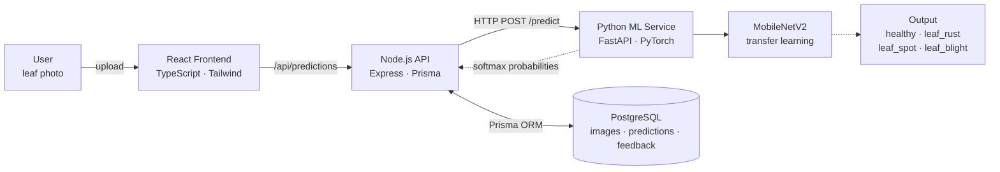

# LEAFNET Schematic Diagram — Generation Prompt

Copy everything below the line into ChatGPT / your image generator.
Save the output as: `apps/web/public/schematic.png` (landscape, ideally 1600×900 or larger).
Then ask the assistant: "wire schematic.png into the landing page."

---

## PROMPT

Create a clean, modern **system architecture schematic diagram** for "Leafnet",
an AI web application that classifies mulberry leaf health from photos.
Style: flat design, dark slate background (#0f172a), rounded rectangles,
subtle drop shadows, thin light-gray arrows (#94a3b8) with arrowheads,
sans-serif labels (Inter/Helvetica). Landscape 16:9. No 3D effects, no gradients
except where specified, generous spacing, presentation-quality.

### Layout (left → right flow)

**Row 1 (main request flow, vertically centered, left to right):**

1. **User** (dark slate box #1e293b, rounded)
   - Label: "User"
   - Sub-label: "mulberry leaf photo"

2. **React Frontend** (green gradient box #16a34a → #15803d, white text)
   - Label: "React Frontend"
   - Sub-label: "TypeScript · Tailwind CSS"

3. **Node.js API** (sky blue box #0ea5e9, white text)
   - Label: "Node.js API"
   - Sub-labels: "Express · Prisma" / "validation · persistence"

4. **Python ML Service** (amber box #f59e0b, white text)
   - Label: "Python ML Service"
   - Sub-labels: "FastAPI" / "PyTorch"

5. **MobileNetV2** (dark green box #14532d with green border #22c55e)
   - Label: "MobileNetV2"
   - Sub-label: "Transfer learning"

**Solid arrows** between 1→2→3→4→5, labeled:
- 1→2: "upload leaf photo"
- 2→3: "/api/predictions"
- 3→4: "HTTP POST /predict"
- 4→5: "224×224 tensor"

**Dashed return arrows** flowing right-to-left below the main row:
- 5→4: "softmax probabilities"
- 4→3: "prediction JSON"
- 3→2: "result displayed"

**Row 2 (below Node.js):**

6. **PostgreSQL** (dark slate cylinder/database shape #334155)
   - Labels: "PostgreSQL" / "images · predictions · feedback · audit logs"
   - Vertical double-headed arrow connecting to Node.js API, labeled "Prisma ORM"

**Row 3 (bottom right corner, small card):**

7. **Four-class output** (dark green card #14532d, green border)
   - Title: "Classification Output"
   - Four small chips inside, one per class:
     - "Healthy" (green chip)
     - "Leaf Rust" (orange chip)
     - "Leaf Spot" (yellow chip)
     - "Leaf Blight" (brown chip)
   - Connected by an arrow from MobileNetV2

### Additional elements

- Small title top-center: "LEAFNET SYSTEM ARCHITECTURE" in letter-spaced gray caps
- Optional subtle dotted boundary grouping boxes 2–4 with label "LEAFNET APPLICATION TIERS"
- Keep all text horizontal and legible
- Do not add icons of leaves, people, clouds, or servers beyond what's specified

### END PROMPT

---

## After generating

1. Save the image as `apps/web/public/schematic.png`
2. Tell me — the landing page will pick it up automatically
   (it currently shows a built-in SVG fallback until the file exists)

## Alternative: Mermaid version (if you prefer editable diagrams)

Render this at mermaid.live and export PNG if you want an editable source.
